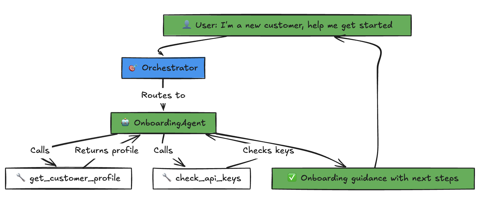
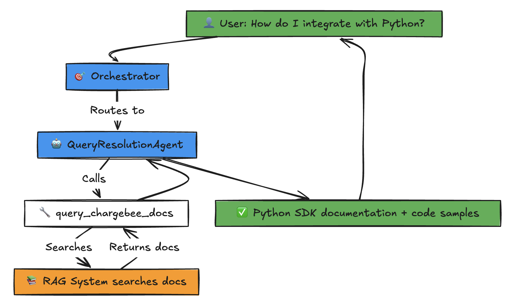
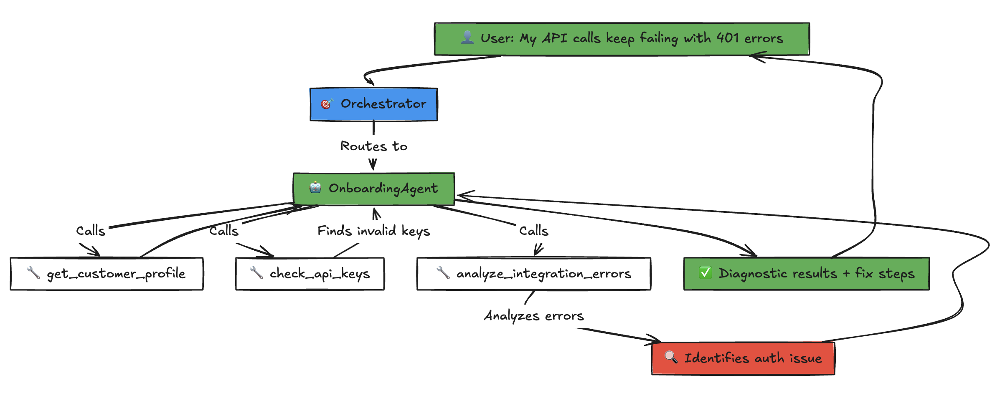
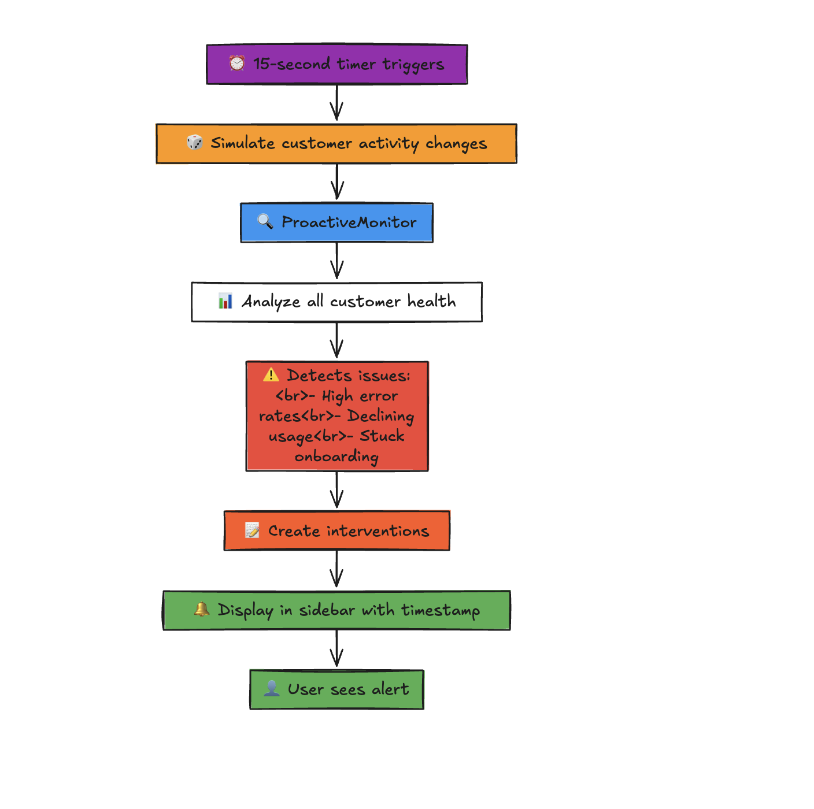

# Aegis - The Antigravity Layer for Customer Success

**Aegis** is a browser-based "Antigravity" layer where AI doesn't just answer questions—it **takes action**.

It sits between your product and your customer, understanding their specific codebase, learning their usage patterns over time, and proactively solving problems before humans ever need to intervene.

> **Beyond Chatbots**: Traditional AI waits for questions. Aegis anticipates needs and executes solutions.

## 🌌 The Vision: Antigravity

Support shouldn't be about answering tickets; it should be about removing friction (gravity) from the customer experience.

- **Codebase Awareness**: Aegis doesn't just read docs; it understands *your customer's* specific implementation and tech stack.
- **Action Over Answers**: Instead of telling a user "Here's how to generate an API key," Aegis generates it, provisions the environment, and writes the integration code for them.
- **Proactive Evolution**: It learns usage patterns to detect when a customer is stuck or ready to scale, intervening *before* they ask for help.

## 🚀 What It Does

Aegis acts as an intelligent, autonomous layer that:

1.  **Understands Context**: "This customer is on the Pro plan, using Python SDK v2, and getting 401 errors."
2.  **Takes Action**: Autonomously creates subscriptions, generates keys, provisions sandboxes, and sends personalized emails.
3.  **Proactively Solves**: Detects integration issues in real-time and reaches out with the exact fix.

## 🚀 Quick Start

### Prerequisites

- Python 3.11+
- pip or poetry
- Docker (for Jira MCP server)

### Environment Setup

1. **Copy the example environment file**:
   ```bash
   cp .env.example .env
   ```

2. **Configure Jira credentials** (required for Jira integration):
   - `JIRA_URL`: Your Jira instance URL (e.g., `https://yourorg.atlassian.net`)
   - `JIRA_USERNAME`: Your Jira email/username
   - `JIRA_API_TOKEN`: Generate from [Atlassian Account Settings](https://id.atlassian.com/manage-profile/security/api-tokens)
   - `JIRA_PROJECT_KEY`: Default project key (e.g., `KAN`, `PROJ`)
   - `JIRA_BASE_URL`: Base URL for ticket links (e.g., `https://yourorg.atlassian.net/browse`)

3. **Configure Chargebee** (optional):
   - `CHARGEBEE_API_KEY`: Your Chargebee API key
   - `CHARGEBEE_MCP_URL`: Chargebee MCP server URL (default provided)

### Installation

```bash
# Clone the repository
cd aegis

# Install dependencies
pip install -r requirements.txt

# Or use poetry
poetry install
```

### Running Locally

#### 1. Run HIL Dashboard (Chat Interface)

```bash
streamlit run aegis/hil/dashboard.py
```

Open http://localhost:8501 to access:
- **Jira Chargebee Agent**: Interactive chat interface for querying Chargebee docs and Jira tickets
- **Execution Flow Visualization**: Collapsible flowchart showing how queries flow from user → orchestrator → specialist agent → tools
- **Approvals Dashboard**: Review and approve high-value agent actions
- **Feedback System**: Provide feedback on agent responses (automatically creates Jira tickets for issues)

#### 2. Trigger Proactive Interventions (Simulate Traffic)

For the demo, you can manually trigger customer activity spikes (errors, usage changes) directly from the dashboard:

1.  Click the **"🎲 Simulate Traffic"** button in the sidebar.
2.  This simulates random events (e.g., 401 error spikes, declining usage) for the demo customers.
3.  Wait a few seconds or click **"🔄 Check Now"**.
4.  View the generated alerts in the **"🔔 Proactive Interventions"** sidebar section.

#### 3. Verify Jira Integration

Aegis autonomously creates Jira tickets for critical issues. To verify:

1.  **Trigger High Errors**: Click "Simulate Traffic" until you see a "High Error Rate" intervention.
2.  **Check for Ticket**: Look for the **"🎫 Ticket: KAN-XX"** link in the intervention card.
3.  **Verify Deduplication**: Click "Simulate Traffic" again. Notice that the **same ticket key** is reused (no duplicates created).


```bash
# Build the image
docker build -t aegis:latest .

# Run with docker-compose
docker-compose up
```


### 🆕 Simple Test Scenario 1: New Customer Onboarding (Autonomous Actions)

**Customer Persona**: Select "New Customer" in dashboard sidebar

**What You'll See**:
- Context Card shows: Tier: NONE, Stage: NEW, API Calls: 0

**Prompt**: 
```
I'm a new customer, help me get started with Chargebee
```

## 🏗️ Architecture


Aegis uses an orchestrator-specialist agent pattern with MCP (Model Context Protocol) integrations:

### Core Components

**Agentic Intelligence**:
- **State Manager**: Tracks customer profiles, onboarding stages, subscription tiers, API activity, health metrics
- **Customer Context Tools**: Analyzes customer health (error rates, usage trends, engagement)
- **Autonomous Action Tools**: Creates subscriptions, generates API keys, sends emails, provisions environments
- **Proactive Monitor**: Background task detecting customer issues and triggering interventions

**Specialized Agents**:
- **Orchestrator Agent**: Routes queries to appropriate specialist agents
- **Onboarding Agent** (AGENTIC): Autonomously executes multi-step onboarding workflows
- **Query Resolution Agent**: Handles Jira tickets and documentation queries  
- **Feedback Agent**: Processes user feedback and creates Jira tickets

### External Integrations

Agents leverage MCP servers for external integrations:
- **Jira MCP Server**: Docker-based MCP server for Jira operations (create tickets, add comments, fetch ticket details)
- **Chargebee MCP Server**: HTTP-based MCP server for Chargebee documentation and code examples

### Agent Communication

Agents communicate via a message transport layer (in-memory for development, Redis adapter for production). The orchestrator:
- Analyzes user intent and context
- Routes queries to the appropriate specialist agent
- Maintains conversation history and context
- Returns structured responses with metadata

### Human-in-Loop (HIL)

High-value actions require human approval via:
- **Streamlit Dashboard**: Interactive chat interface with feedback system and approval workflows
- **Execution Flow Visualization**: Visual flowchart showing the complete execution path (Query → Orchestrator → Agent → Tools) for each response
- **Feedback System**: Users can provide thumbs up/down feedback, automatically creating Jira tickets for negative feedback
- **FastAPI HIL API**: REST endpoints for programmatic approval workflows


## ✨ Key Features (What Makes This Agentic)

### 🧠 Intelligence
1. **Customer Context Awareness**: Knows subscription tier, onboarding stage, API usage, error patterns before responding
2. **Health Monitoring**: Analyzes engagement scores, error rates, usage trends, risk factors
3. **Decision Logic**: Decides WHAT to do based on customer state, not just what to say

### ⚙️ Autonomous Actions
4. **Subscription Management**: Creates trial accounts, upgrades plans, applies discounts
5. **API Key Generation**: Generates test/production keys autonomously
6. **Environment Provisioning**: Sets up sandbox environments for testing
7. **Personalized Communication**: Sends setup emails with actual customer data

### 🚀 Proactive Behavior  
8. **Background Monitoring**: Detects onboarding stuck, high errors, usage spikes without user asking
9. **Preventive Intervention**: Offers debugging help, retention outreach, upsell suggestions proactively
10. **Multi-Step Orchestration**: Executes complex end-to-end workflows (create → provision → notify → monitor)

### 🔧 Traditional Features
11. **RAG Documentation Search**: Vector-based search for Chargebee docs (when retrieval is needed)
12. **Jira Integration**: Creates tickets, tracks issues, manages customer feedback
13. **Human-in-Loop**: Approval workflows for high-risk actions
14. **Stateful Conversations**: Memory across interactions using Google ADK Sessions
15. **Execution Flow Visualization**: Visual flowchart showing agent routing and tool execution paths


## 🎭 Demo Scenarios - See Agentic AI in Action

These scenarios demonstrate the difference between traditional RAG and truly agentic behavior.

### 🆕 Scenario 1: New Customer Onboarding (Autonomous Actions)

**Customer Persona**: Select "New Customer" in dashboard sidebar

**What You'll See**:
- Context Card shows: Tier: NONE, Stage: NEW, API Calls: 0

**Prompt**: 
```
I'm a new customer, help me get started with Chargebee
```

**Agentic Behavior** (What the Agent DOES):
1. ✅ Calls `get_customer_profile()` to analyze state
2. ✅ Detects: No subscription exists
3. ✅ **Autonomously executes**: `create_trial_subscription()`
4. ✅ **Autonomously executes**: `generate_api_keys(environment='test')`
5. ✅ Provides actual API key in response (not just instructions)
6. ✅ Updates customer state to TRIAL_CREATED

**Expected Response**:
```
Diagnostic Results:
- Customer Status: NEW - No active subscription found.
- Requirement: Needs trial account and API keys.

Actions Taken:
- Executed create_trial_subscription() → Created trial (expires in 14 days).
- Executed generate_api_keys(env='test') → Generated key sk_test_[actual_key].

Next Steps:
- Use the code below to make your first API call.
[personalized code snippet]
```



**Key Difference**: Agent doesn't tell them HOW - it DOES it for them.

---

### 🔄 Scenario 2: Customer Context Awareness

**Customer Persona**: Select "Trial Customer" in dashboard sidebar

**What You'll See**:
- Context Card shows: Tier: TRIAL, Stage: API_KEYS_GENERATED, Health: ⚠️ Needs Attention

**Prompt**:
```
How do I integrate with Python?
```

**Agentic Behavior**:
1. ✅ Calls `get_customer_profile()` - sees they already have subscription + keys
2. ✅ Calls `query_chargebee_code()` for Python examples
3. ✅ Generates personalized code with THEIR actual API key pre-filled

**Expected Response**:
```
Diagnostic Results:
- Customer Status: TRIAL - Active subscription found.
- API Key Status: FOUND - Existing key sk_test_xxx available.

Actions Taken:
- Executed query_chargebee_code() → Retrieved Python integration examples.
- Contextualized Code → Injected actual API key sk_test_xxx into example.

Next Steps:
- Copy the code below to integrate Chargebee with Python.
[Code with their actual API key embedded]
```


**Key Difference**: Agent adapts based on customer state, doesn't repeat work already done.

---

### 🚨 Scenario 3: Error Detection & Health Analysis

**Customer Persona**: Select "At-Risk Customer" in dashboard sidebar

**What You'll See**:
- Context Card shows: Health: 🚨 At-Risk, Error Rate: 15%, Usage: Declining

**Prompt**:
```
My API calls keep failing with 401 errors
```

**Agentic Behavior**:
1. ✅ Calls `get_customer_health()` - sees high error rate pattern
2. ✅ Analyzes error trends
3. ✅ Identifies root cause (invalid keys, auth issues, etc.)
4. ✅ Offers specific solution, not generic advice

**Expected Response**:
```
Diagnostic Results:

- Root Cause: KEY_VALID_BUT_HEADERS_INCORRECT - API key appears valid but request headers are likely incorrect.
- API Key Status: SUCCESS - Key sk_test_demo123... is valid and active
- Authentication Test: SUCCESS - Authentication working correctly; response_code: 200, response_time_ms: 247

Actions Taken:

- Executed diagnose_401_error() → Root cause identified: KEY_VALID_BUT_HEADERS_INCORRECT
- Executed verify_api_key() → Confirmed key sk_test_demo123... is VALID
- Executed test_api_authentication() → Test call returned 200 OK (247ms)
- Executed apply_fix_for_401() → Prepared authentication example:
[Code block with fix]

Next Steps:

- Please replace "sk_test_YOUR_KEY" in the code example above with your actual API key: "sk_test_demo123...".
- Test the authentication using the updated code example and verify you get a 200 OK response.
- If you are still encountering issues, please contact support with the error details for further assistance.
```




**Key Difference**: Agent analyzes THEIR data, provides diagnosis, not generic troubleshooting.

---

### 🔔 Scenario 4: Proactive Monitoring

**What You'll See**: Check sidebar "Proactive Interventions" section

**Agentic Behavior** (Running in background):
- Monitor detects: Customer has API keys for 24h but 0 API calls
- **Autonomous decision**: Trigger onboarding check-in intervention
- Creates proactive message without user asking

**Intervention Example**:
```
Type: Onboarding Check-In
Customer: Trial Customer (Startup Inc)
Reason: No API activity 24h after key generation
Priority: MEDIUM

Message: "I noticed you generated API keys 24h ago but haven't 
made any API calls yet. Need help with integration?"
```


**Key Difference**: Agent takes initiative, doesn't wait for customer to ask for help.

---

### 📊 Understanding the Demo

**Traditional RAG Approach**:
```
User: "Help me get started"
Agent: [Retrieves docs] "Here's how to create an account..."
```

**Agentic Approach (Aegis)**:
```
User: "Help me get started"
Agent thinks:
  1. What's their current state? [Analyzes]
  2. What do they need? [Decides]
  3. What actions should I take? [Executes]
Agent: "I've created your account! Here's your API key..."
```

**The Innovation**: AI that analyzes context → makes decisions → takes action

## 🛠️ Development

### Project Structure

```
aegis/
├── agents/              # Agent implementations
│   ├── orchestrator_agent.py      # Central orchestrator
│   ├── onboarding_agent.py        # AGENTIC onboarding specialist
│   ├── query_resolution_agent.py  # Query handler
│   ├── feedback_agent.py          # Feedback processing
│   └── base.py                    # Base agent classes
├── tools/               # Tools for agent actions and intelligence
│   ├── customer_context.py        # NEW: Customer state & health analysis
│   ├── chargebee_actions.py       # NEW: Autonomous action tools
│   ├── jira_mcp.py                # Jira MCP integration
│   ├── chargebee_ops_mcp_tool.py  # Chargebee MCP integration
│   ├── chargebee_client.py        # Chargebee API client
│   └── zendesk_client.py          # Zendesk API client
├── state/               # NEW: Customer state management
│   └── state_manager.py           # Tracks profiles, workflows, health
├── monitors/            # NEW: Proactive intelligence
│   └── proactive_monitor.py       # Background health monitoring
├── transports/          # Message transport layer
│   ├── in_memory_transport.py     # In-memory transport
│   └── redis_adapter.py           # Redis transport adapter
├── hil/                 # Human-in-loop dashboard and API
│   ├── dashboard.py               # Streamlit chat interface (ENHANCED)
│   └── api.py                     # FastAPI HIL endpoints
├── protocols/           # Agent-to-agent protocols
├── cli/                 # CLI runners
└── config.py            # Centralized configuration

tests/                   # Test suite
docs/                    # Documentation
.env.example             # Environment variables template
```

## 📋 Current Status & TODO

### ✅ Implemented Features

- ✅ Orchestrator-based agent routing system
- ✅ Jira MCP integration (create tickets, add comments, fetch details)
- ✅ Chargebee MCP integration (documentation and code examples)
- ✅ Interactive chat interface with conversation memory
- ✅ Feedback system with automatic Jira ticket creation
- ✅ Human-in-loop approval dashboard
- ✅ Centralized configuration management
- ✅ **Execution flow visualization**: Visual flowchart showing Query → Orchestrator → Agent → Tools path


### 🚧 Production Implementation TODO

This repository contains a working MVP. For production deployment, implement:

#### Core Infrastructure
- [ ] Replace in-memory transport with Redis for multi-process communication
- [ ] Integrate real vector database (Qdrant, Pinecone) for RAG
- [ ] Set up persistent storage for customer contexts (PostgreSQL, Redis)
- [ ] Configure Google ADK with Gemini API credentials
- [ ]   Implement A2A for agent communication

#### Agent Logic
- [ ] Implement real intent classification using Gemini 2.5 Pro
- [ ] Build RAG pipeline with document embeddings
- [ ] Integrate with actual billing system (Chargebee, Stripe)
- [ ] Connect to support ticketing (Zendesk, Intercom)
- [ ] Implement ML-based churn prediction model

#### HIL & Monitoring
- [ ] Persist HIL approval requests to database
- [ ] Implement agent callback system for approved actions
- [ ] Add authentication and authorization to HIL dashboard
- [ ] Set up monitoring and alerting (Datadog, Prometheus)
- [ ] Implement audit logging for all agent actions

#### Security
- [ ] Replace all placeholder API keys with secrets management (Google Secret Manager)
- [ ] Add input validation and sanitization
- [ ] Implement rate limiting and abuse prevention
- [ ] Set up RBAC for HIL approvals
- [ ] Enable encryption for sensitive data


## 🎯 Next Steps for Production

### Implemented ✅
- [x] Agentic onboarding agent with autonomous actions
- [x] Customer state management and health monitoring
- [x] Autonomous action tools (subscriptions, keys, emails)
- [x] Proactive monitoring system
- [x] Enhanced dashboard with customer context
- [x] Multi-step workflow orchestration

### Production TODO ⚠️
- [ ] Replace mock Chargebee actions with real API calls
- [ ] Add persistent state storage (Redis/PostgreSQL)
- [ ] Implement ML-based churn prediction
- [ ] Deploy proactive monitor as background service
- [ ] Add authentication and RBAC to dashboard
- [ ] Implement audit logging for all autonomous actions
- [ ] Set up monitoring and alerting infrastructure

## 🤝 Contributing

This project demonstrates truly agentic AI architecture. Fork and extend for your use case.

## 📄 License

MIT License - see LICENSE file for details

---

**Built with ❤️ using Google ADK, Gemini 2.x Models,Jira and Chargebee MCP**

*From RAG to Real Action: AI that doesn't just answer - it executes.*
