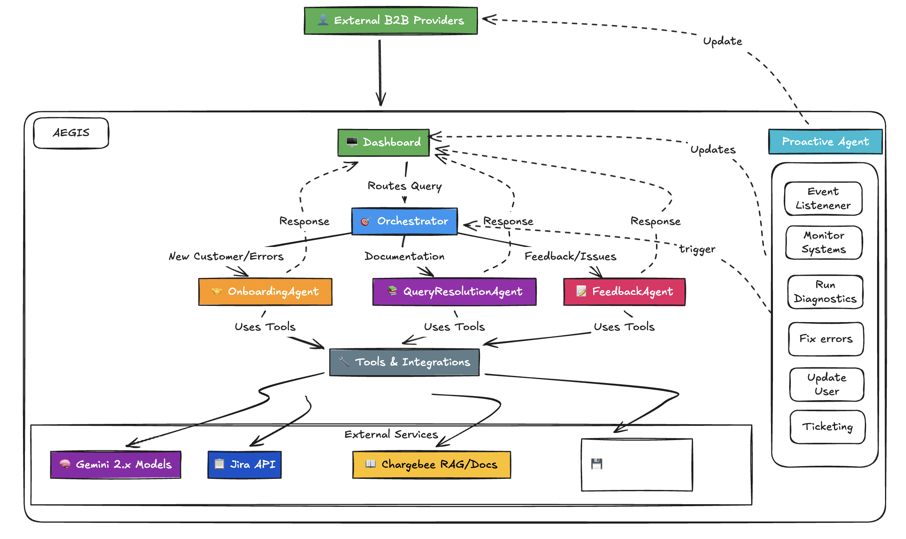
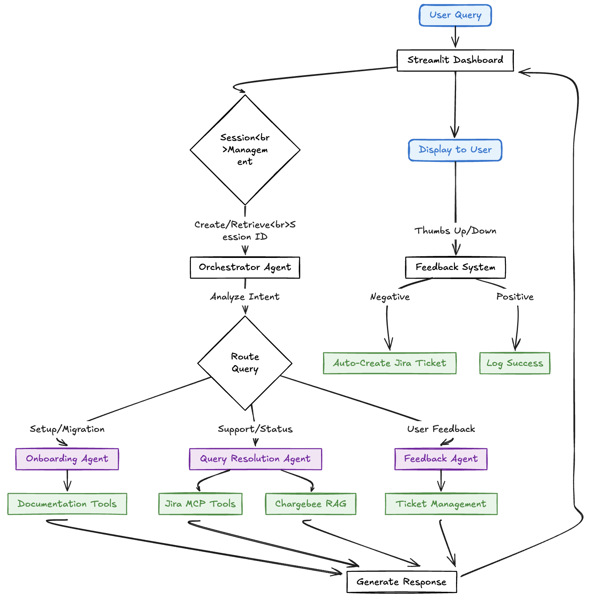

# Aegis - Multi-Agent Enterprise AI Concierge

🛡️ **Aegis** is a multi-agent enterprise AI concierge built on Google ADK (Agent Development Kit). It provides intelligent, automated assistance for customer onboarding, integrations, operations, and growth.

## 💡 The Problem

Enterprise support teams are overwhelmed.
- **Repetitive Queries**: "How do I integrate X?" or "Where are my API keys?" consume 80% of support time.
- **Context Switching**: Agents constantly toggle between Jira, billing dashboards (Chargebee), and documentation.
- **Slow Onboarding**: New customers get stuck on setup, leading to churn before they even start.

## 🛠️ The Solution

**Aegis** solves this by deploying a team of specialized AI agents orchestrated to handle complex workflows:
1.  **Orchestrator**: The "brain" that understands intent and routes tasks.
2.  **Specialists**: Dedicated agents for Onboarding, Query Resolution, and Feedback.
3.  **Action-Oriented**: Unlike simple chatbots, Aegis *does* things—checks live Jira status, fetches real-time docs, and logs tickets.

## 🏗️ Architecture



## 🏗️ Flow Diagram



Aegis uses an orchestrator-specialist agent pattern with MCP (Model Context Protocol) integrations:

### Core Agents

- **Orchestrator Agent**: Central coordinator that analyzes user queries and routes them to the appropriate specialist agent
- **Jira Chargebee Agent**: Handles Jira ticket queries and Chargebee documentation lookups with conversational memory
- **Query Resolution Agent**: Resolves general queries about Chargebee using RAG-powered documentation retrieval
- **Onboarding Agent**: Assists with customer onboarding, documentation, and setup guidance

### External Integrations

Agents leverage MCP servers for external integrations:
- **Jira MCP Server**: Docker-based MCP server for Jira operations (create tickets, add comments, fetch ticket details)
- **Chargebee MCP Server**: HTTP-based MCP server for Chargebee documentation and code examples

### Agent Communication

Agents communicate via a message transport layer (in-memory for development, Redis adapter for production). The orchestrator:
- Analyzes user intent and context
- Routes queries to the appropriate specialist agent
- Maintains conversation history and context
- Returns structured responses with metadata

### Human-in-Loop (HIL)

High-value actions require human approval via:
- **Streamlit Dashboard**: Interactive chat interface with feedback system and approval workflows
- **Feedback System**: Users can provide thumbs up/down feedback, automatically creating Jira tickets for negative feedback
- **FastAPI HIL API**: REST endpoints for programmatic approval workflows

## ✨ Key Features

1.  **Multi-Agent Orchestration**: Intelligent routing of queries to specialized agents (Onboarding, Support, Feedback) based on intent.
2.  **Tool Use (Function Calling)**: Agents autonomously execute actions like checking Jira status, creating tickets, and querying documentation.
3.  **RAG (Retrieval Augmented Generation)**: Vector-based search for Chargebee documentation to provide accurate, grounded answers.
4.  **Human-in-the-Loop**: Seamless feedback mechanism where user reactions trigger automated workflows (e.g., negative feedback -> Jira ticket).
5.  **Stateful Sessions**: Persistent conversation history and context management using Google ADK Sessions.

## 🚀 Quick Start

### Prerequisites

- Python 3.11+
- pip or poetry
- Docker (for Jira MCP server)

### Environment Setup

1. **Copy the example environment file**:
   ```bash
   cp .env.example .env
   ```

2. **Configure Jira credentials** (required for Jira integration):
   - `JIRA_URL`: Your Jira instance URL (e.g., `https://yourorg.atlassian.net`)
   - `JIRA_USERNAME`: Your Jira email/username
   - `JIRA_API_TOKEN`: Generate from [Atlassian Account Settings](https://id.atlassian.com/manage-profile/security/api-tokens)
   - `JIRA_PROJECT_KEY`: Default project key (e.g., `KAN`, `PROJ`)
   - `JIRA_BASE_URL`: Base URL for ticket links (e.g., `https://yourorg.atlassian.net/browse`)

3. **Configure Chargebee** (optional):
   - `CHARGEBEE_API_KEY`: Your Chargebee API key
   - `CHARGEBEE_MCP_URL`: Chargebee MCP server URL (default provided)

### Installation

```bash
# Clone the repository
cd aegis

# Install dependencies
pip install -r requirements.txt

# Or use poetry
poetry install
```

### Running Locally

#### 1. Run HIL Dashboard (Chat Interface)

```bash
streamlit run aegis/hil/dashboard.py
```

Open http://localhost:8501 to access:
- **Jira Chargebee Agent**: Interactive chat interface for querying Chargebee docs and Jira tickets
- **Approvals Dashboard**: Review and approve high-value agent actions
- **Feedback System**: Provide feedback on agent responses (automatically creates Jira tickets for issues)

#### 2. Run HIL API (Optional)

```bash
python aegis/hil/api.py
```

API will be available at http://localhost:8001. View docs at http://localhost:8001/docs.

### Using Docker

```bash
# Build the image
docker build -t aegis:latest .

# Run with docker-compose
docker-compose up
```

Services:
- Supervisor: Runs agent demo
- HIL Dashboard: http://localhost:8501
- HIL API: http://localhost:8001

## 🧪 Testing

```bash
# Run all tests
pytest tests/ -v

# Run specific test file
pytest tests/test_imports.py -v

# Run with coverage
pytest --cov=aegis tests/
```

## 🎭 Test Scenarios

Use these scenarios to verify the functionality of each agent through the HIL Dashboard.

### Onboarding Agent

**Scenario 1: New Customer Welcome**
```
Prompt: "I'm a new customer, help me get started with Chargebee"
Expected: Agent should introduce itself, ask discovery questions, and provide step-by-step onboarding guidance
```

**Scenario 2: Migration Assistance**
```
Prompt: "I want to migrate from Stripe to Chargebee"
Expected: Agent should outline migration steps, required data, and potential challenges
```

**Scenario 3: Integration Setup**
```
Prompt: "How do I integrate Chargebee with my app?"
Expected: Agent should provide integration options, code examples, and setup instructions
```

### Query Resolution Agent

**Scenario 1: Jira Ticket Status (Real-time Integration)**
```
Prompt: "What is the status of KAN-7?"
Expected: Agent calls get_ticket_status tool and returns current status (e.g., "To Do", "In Progress")
Note: Replace KAN-7 with a valid ticket key from your Jira project
```

**Scenario 2: Jira Ticket Details**
```
Prompt: "Show me details for ticket PROJ-123"
Expected: Agent calls get_ticket_details and returns summary, assignee, priority, etc.
```

**Scenario 3: Chargebee Documentation Query**
```
Prompt: "How do I create a subscription in Chargebee?"
Expected: Agent uses query_chargebee_docs tool to retrieve and summarize documentation
```

**Scenario 4: Chargebee Code Examples**
```
Prompt: "Show me Python code to create a customer in Chargebee"
Expected: Agent uses query_chargebee_code tool to provide working code snippets
```

**Scenario 5: Feature Request (Creates Jira Ticket)**
```
Prompt: "I need a way to bulk update customer subscriptions"
Expected: Agent should offer to create a Jira ticket for the feature request
```

### Testing Tips

1. **Verify Tool Execution**: Check terminal logs for messages like:
   ```
   DEBUG: Calling get_ticket_status with args: {'issue_key': 'KAN-7'}
   Function result: Ticket KAN-7: {'name': 'To Do'...}
   ```

2. **Test Retry Logic**: If you see rate limit errors, the system should automatically retry:
   ```
   Rate limit hit, retrying in 2s...
   ```

3. **Check Orchestration**: Each query should show routing decision:
   ```
   Routed query 'What is the status of KAN-7?' to query_resolution
   ```

## 🛠️ Development


### Code Quality

```bash
# Format code
black aegis/ tests/
isort aegis/ tests/

# Type checking
mypy aegis/

# Pre-commit hooks
pre-commit install
pre-commit run --all-files
```

### Project Structure

```
aegis/
├── agents/              # Agent implementations
│   ├── orchestrator_agent.py      # Central orchestrator
│   ├── jira_chargebee_agent.py    # Jira + Chargebee specialist
│   ├── query_resolution_agent.py  # General query handler
│   ├── onboarding_agent.py        # Onboarding specialist
│   ├── feedback_mixin.py          # Feedback handling logic
│   └── base.py                    # Base agent classes
├── tools/               # MCP tools and API clients
│   ├── jira_mcp.py                # Jira MCP integration
│   ├── chargebee_ops_mcp_tool.py  # Chargebee MCP integration
│   ├── chargebee_client.py        # Chargebee API client
│   └── zendesk_client.py          # Zendesk API client
├── transports/          # Message transport layer
│   ├── in_memory_transport.py     # In-memory transport
│   └── redis_adapter.py           # Redis transport adapter
├── hil/                 # Human-in-loop dashboard and API
│   ├── dashboard.py               # Streamlit chat interface
│   └── api.py                     # FastAPI HIL endpoints
├── protocols/           # Agent-to-agent protocols
├── cli/                 # CLI runners
└── config.py            # Centralized configuration

tests/                   # Test suite
docs/                    # Documentation
.env.example             # Environment variables template
```

## 📋 Current Status & TODO

### ✅ Implemented Features

- ✅ Orchestrator-based agent routing system
- ✅ Jira MCP integration (create tickets, add comments, fetch details)
- ✅ Chargebee MCP integration (documentation and code examples)
- ✅ Interactive chat interface with conversation memory
- ✅ Feedback system with automatic Jira ticket creation
- ✅ Human-in-loop approval dashboard
- ✅ Centralized configuration management

### 🚧 Production Implementation TODO

This repository contains a working MVP. For production deployment, implement:

#### Core Infrastructure
- [ ] Replace in-memory transport with Redis for multi-process communication
- [ ] Integrate real vector database (Qdrant, Pinecone) for RAG
- [ ] Set up persistent storage for customer contexts (PostgreSQL, Redis)
- [ ] Configure Google ADK with Gemini API credentials

#### Agent Logic
- [ ] Implement real intent classification using Gemini 2.5 Pro
- [ ] Build RAG pipeline with document embeddings
- [ ] Integrate with actual billing system (Chargebee, Stripe)
- [ ] Connect to support ticketing (Zendesk, Intercom)
- [ ] Implement ML-based churn prediction model

#### HIL & Monitoring
- [ ] Persist HIL approval requests to database
- [ ] Implement agent callback system for approved actions
- [ ] Add authentication and authorization to HIL dashboard
- [ ] Set up monitoring and alerting (Datadog, Prometheus)
- [ ] Implement audit logging for all agent actions

#### Security
- [ ] Replace all placeholder API keys with secrets management (Google Secret Manager)
- [ ] Add input validation and sanitization
- [ ] Implement rate limiting and abuse prevention
- [ ] Set up RBAC for HIL approvals
- [ ] Enable encryption for sensitive data

## 📖 Documentation

- [Message Schema Examples](docs/messages.md) - Example agent-to-agent messages
- [HIL API Schema](docs/hil_api_schema.yaml) - OpenAPI spec for HIL endpoints

## 🎯 Hackathon Next Steps

1. **Pick a vertical**: Choose one specialist agent to flesh out (e.g., onboarding)
2. **Add real LLM calls**: Integrate Gemini API for intent classification or RAG
3. **Build a demo flow**: Create an end-to-end workflow from user query to HIL approval
4. **Add UI**: Enhance the Streamlit dashboard with customer-facing chat interface
5. **Implement one integration**: Connect to a real API (e.g., Slack notifications)

## 🤝 Contributing

This is a boilerplate project. Fork and extend as needed for your use case.

## 📄 License

MIT License - see LICENSE file for details

---

**Made with ❤️ for Enterprise AI**
